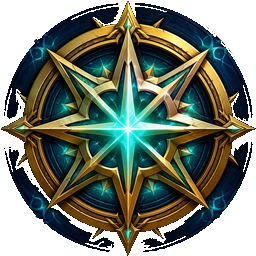

<p align="center">
  
</p>

<h1 align="center">Lodestar</h1>

<p align="center"><strong>Find what matters. Ignore the rest.</strong></p>

<p align="center">
  A decision engine for World of Warcraft. Blizzard shows you everything you can do.<br>
  Lodestar tells you what is worth doing next.
</p>

<p align="center">
  <a href="https://discord.gg/a7hrHavcwq"></a>
  <a href="https://github.com/Co2Noss/Lodestar"></a>
  <a href="https://www.curseforge.com/wow/addons/lodestar-guide"></a>
  <a href="https://github.com/Co2Noss/Lodestar/releases"></a>
</p>

## Download

[](https://www.curseforge.com/wow/addons/lodestar-guide)
[](https://github.com/Co2Noss/Lodestar)
[](https://github.com/Co2Noss/Lodestar/releases)

## Community

[](https://discord.gg/a7hrHavcwq)
[](https://github.com/Co2Noss/Lodestar/issues)
[](https://github.com/Co2Noss/Lodestar/wiki)

The [wiki](https://github.com/Co2Noss/Lodestar/wiki) covers install, the dashboard canvas, ranking, and how other addons register tiles.

Questions and install help belong on [Discord](https://discord.gg/a7hrHavcwq) (`/faq`, or a ticket in `#get-help`). Reproducible bugs go to [GitHub issues](https://github.com/Co2Noss/Lodestar/issues). If you are not sure Lodestar is the addon erroring, `/ls debug` isolates it. [SUPPORT.md](SUPPORT.md) is the same map in one page.

## Donate

[](http://paypal.me/Co2Noss)

Lodestar answers one question: what is the best use of your next hour in World of Warcraft?

## Optional addons

Lodestar works on its own. These addons unlock extra behaviour if they are loaded:

- **TradeSkillMaster, Auctionator, RECrystallize** — gold prices. Without one, gold making stays quiet. Lodestar does not invent an auction house. Settings → Optional Addons picks the source.
- **Raider.IO** — colours the Mythic+ dashboard tile from your profile. Without it, that tile still shows the client's mythic rating.
- **TomTom** — multiple waypoints and a closest-arrow. Settings → Optional Addons can force TomTom, the client's map pin, or Auto (TomTom when loaded).
- **HandyNotes** plus a notes pack — nearby **rares** those packs mark. [HandyNotes](https://www.curseforge.com/wow/addons/handynotes) by itself has no coordinates; packs such as [Midnight](https://www.curseforge.com/wow/addons/handynotes-midnight) and [Silvermoon](https://www.curseforge.com/wow/addons/handynotes-silvermoon) (and many others) supply the pins. Lodestar ranks rares, not treasures or other map marks (trainers, vendors, chests). Known rewards stay hidden if the pack hid them. Without a pack, Lodestar stays quiet about rares.
- **ElvUI** — the ElvUI theme reads ElvUI's live backdrop, texture and font. A near-black ElvUI border falls back to a lighter grey.
- **GW2 UI** — Auto follows GW2 UI when it is loaded. The GW2 theme uses GW2 UI's gold and font when `GW2_ADDON` exposes them.
- **RealUI** — Auto follows RealUI / Aurora when loaded. The RealUI theme reads `Aurora.Color` when Aurora is there.
- **Great Vault Key Info** — Champion/Hero ranks on slots in the client's Great Vault window. Lodestar does not copy those season tables; Dashboard hover uses named keys and reward item levels the client already has.

## First login

Lodestar asks what you care about before it recommends anything. Every goal starts off, the
window opens on the welcome page at your first login, and nothing is ranked until you pick at
least one goal. It says there and then that Settings can change your answer at any time.

The reason it asks instead of guessing: a goal that is off silently removes recommendations,
and a player who never chose those defaults has no way to know what is missing.

Existing installs are left alone. Goals you already chose count as an answer, so the welcome
page never interrupts an upgrade.

After you pick goals, a short tip tour covers the window. **Next** is the next tip. **Skip**
hides the rest. Returning players only see tips for features added since they last played.
Settings → Changelog has the last five versions.

## Pages

The left menu is workspaces, not content categories. Collapse it to icons (a pin for
Today's Plan, a fire for Warband, and so on); hover an icon for the name. Professions live on Dashboard; the tile shows your two
primary profession icons and opens that profession in front of Lodestar when you click one;
click again to close it. Great Vault opens from
Dashboard; Progress is the tracked list.

- **Dashboard** — a layout of widgets you pick. The default set is the plan snapshot, shortcuts, professions, and the next card. Edit dashboard to add Great Vault, tracked work, WoW Token, weekly reset, warband, HandyNotes rares, Mythic+, gold, currencies, PvP, item level, housing, battle pets, calendar, guild, Delver's Journey, or Preyhunter's Journey, then drag and resize them on that tab. Great Vault still opens the client's chest. Clicking vault slots opens Lodestar's breakdown.
- **Today's Plan** — recommendations matching your goals, ranked best first and split into tabs by where the work happens. The last tab you were on is remembered.
- **Weekly Plan** — the subset that resets: Great Vault, bountiful delves, weekly profession knowledge, weekly Conquest, neighborhood initiatives, housing weeklies already in the log, weekly pet battle quests already in the log.
- **Long-Term Goals** — mounts, treasures, reputation, gold, catch-up, unlocking battle pets. Which of those to rank is still chosen in Settings.
- **Progress** — activities you tracked, in score order. Compact mode shows the same list. Track or Untrack from Details.
- **Ignored Tasks** / **Completed Tasks** — restore cards you hid or marked done.
- **Warband** — every character Lodestar has seen, with vault and knowledge status. When more than one character is saved, each alt can be tracked or untracked so it drops out of totals and warband gold without being forgotten.
- **Settings** — split into Goals, Optional Addons, Reputation, Appearance, Compact, Layout and Changelog, so each group is a click rather than a scroll. The last tab you were on is remembered.
- **FAQ** — why something is missing, and what Lodestar is not. Goals start off, gold needs a price source, rares need HandyNotes plus a notes pack, and so on.
- **Help** — commands, the window, debug isolation, and copy-to-clipboard links to [Discord](https://discord.gg/a7hrHavcwq) and [GitHub issues](https://github.com/Co2Noss/Lodestar/issues).

## Dashboard widgets

Edit dashboard to add, remove, or drag tiles on a **12 × 18** canvas that exists
only on that tab and grows down to **36** rows when you add more. While you are
editing, a tile shows its settings rather than live Honor, gold, or house favor;
click Done editing to see the data again. Drag a tile to move it; drag the right edge, bottom edge, or
corner to resize it horizontally or vertically. Tiles cannot overlap; Compact up
packs them to the top. Dragging lifts the tile, leaves a ghost in its old cell, and
marks empty rooms with a bordered plus so you can see where it can land.
The default layout is Overview, Jump, Professions, and Next, each starting at half
width — the same size as WoW Token and the other addable tiles. Tiles that need another
addon stay out of the add list until that addon is loaded: rares need HandyNotes plus a notes pack.
Mythic+, Gold, Currencies, PvP, Item Level, Readiness, Housing, Battle Pets, Calendar, Guild, Delver's Journey, and Preyhunter's Journey are always available. Mythic+ uses
the client's overall dungeon score (Raider.IO colours it when loaded). Click the tile to
open the client's Mythic+ Dungeons tab; click again to close it. Click a dungeon with
its Keystone Hero teleport in your spellbook to go there; the main window closes. Gold sums
characters Lodestar has seen, plus the warband bank when the client reports it; hover lists each character. Currencies start on
this expansion and use the client's rarity colour; edit mode toggles what to track
(and hides live amounts until you click Done editing). Click
the tile to open the currency tab; click again to close it. PvP
shows honor plus seasonal ratings; edit mode lists 2v2, 3v3, Shuffle, Blitz, and RBG
without the live Honor line so nothing is clipped.
Item Level shows equipped average and best-in-bags, coloured by rarity. Click the tile
to open the character panel; click again to close it. Slot icons
show that piece's item level in its rarity colour, a red border when an enchant is
missing, and a yellow caution when the client reports an empty gem slot. Helm and
rings take both; shoulder takes enchants; wrist takes sockets; back takes neither.
A gemmed ring is not flagged for sockets. Missing
enchants and sockets are listed beside the gear so two flags on one piece never overlap.
**Readiness** checks this expansion's food, flask, augment rune, and weapon oil
or whetstone from bags and buffs. Click a slot to eat, use, or apply it.
**Housing** shows the house name, level, and favor the client reports, with a bar
toward the next house level, **Dashboard**
to open the client's Housing Dashboard (click again to close it) and **Teleport** when `C_Housing.TeleportHome`
has a house GUID.
**Battle Pets** shows unique pets and your battle team from the journal. Click the
tile to open the pet journal (click again to close it); click a slotted pet to summon it.
**Calendar** lists this week and next from the client's calendar, including guild events
and invites; click opens the calendar, click again closes it. **Guild** shows the guild name with the emblem
centered under it; click opens Communities, click again closes it. **Delver's Journey** and **Preyhunter's Journey** show this
season's rank from the client with a bar toward the next rank; click opens Journeys, click again closes it.
Tiles fill the chrome they sit in. Hover for tooltips: Mythic+ uses your player tooltip
(shift refreshes it), currencies use the same tooltip as the currency tab.

WoW Token uses `C_WowTokenPublic` — the price the client published, not an invented AH.
A trend line only appears after Lodestar has seen more than one live price. Edit dashboard
to change how the tile looks: **Coin icons** uses the client's gold coin, **Letters** uses
g/s/c (gold, silver, and copper), **Color** tints letter amounts gold, **Separators** inserts thousands commas, and
**Bars** / **Line** switches the trend from a bar chart to a line.

Other addons can pin a tile after Lodestar loads:

```lua
Lodestar:RegisterWidget({
  id = "myaddon_foo",
  title = "Foo",
  defaultSize = "half", -- or defaultW / defaultH in canvas cells
  render = function(self, parent, width)
    -- parent is a frame; return the height you used
    return 40
  end,
})
```

## Ranking and categories

Recommendations are scored against the goals you chose on first login, which Settings can
change at any time, then grouped by where the work happens: Great Vault, Professions,
Mounts, Reputation, Solo content, Questing, PvP, Housing, Battle Pets. Today's Plan, Weekly Plan, Great Vault, Professions
and Settings each use the same tab strip, so moving between groups is a click rather than a
scroll. Tab order is stable; the work inside a tab is still ranked best first. The last tab
on each page is remembered.

Every card shows its priority and score. Priority is High, Medium or Low.
Unspent knowledge, weekly lockouts, an unclaimed Great Vault, a stalled campaign and an
active Prey hunt are High, because missing them costs something this week. Important quests
in the log (including Prey and Voidcore unlocks) rank with the campaign. Gathering and unfinished secondaries are Medium. Treasures,
HandyNotes rares, catch-up, dungeon mount farms, unfinished reputations, gold farms and an empty quest
log asking you to check the map are Low, because they wait. Score still decides the order.

There is no time budget. Lodestar ranks and groups everything instead of asking how long you
have and hiding whatever does not fit.

## Great Vault accuracy

Great Vault and bountiful delves stay off the plan until you are at the expansion cap
(90 in Midnight). Until then Lodestar ranks leveling, and professions if that goal is on.

Slots report a real difficulty or tier, never a raw difficulty ID. Upgrade effort is counted
from the runs and boss kills you have actually banked this week, so "complete 4 delves at
Tier 8 or higher" reflects what is left rather than a guess.

A slot is only called maxed when it reaches the tier cap in `LS.tierCaps` or the highest
tier you have personally cleared. Edit that table when a patch changes the cap.

Dashboard hover lists this week's named keys from the run history the client already has,
and a reward item level when the vault example item is loaded. It does not keep a season
Champion/Hero table. [Great Vault Key Info](https://www.curseforge.com/wow/addons/great-vault-key-info)
still does that in the client's vault window (the Vault button).

If last week's Great Vault is still unclaimed after Tuesday reset, Today ranks that first:
open the vault and pick a reward from each filled slot. Filling this week's chest is a
separate job.

A Bountiful Delve stays off Today once the World Vault is finished, you have no Restored
Coffer Keys, you cannot make another key from shards, and this week's T11 Gilded Stashes
are done. While it is worth doing, Lodestar names today's bountiful delves from the map
POIs rather than a stored list. Portal continents such as Harandar and Voidstorm are
included even when you are in Quel'Thalas. If the client has not named them yet, the card
still asks you to run one and to check the map.

Questing ranks the current campaign (including catch-up when a chapter is stalled), quests
the client marks **important**, and a few other quests already in the log. Important quests
are campaign-priority: Prey unlocks and Voidcore / Voidforge unlocks use that flag, so
Lodestar does not keep a list of those quest IDs. World quests stay off that card. If the
log is empty and no campaign or important work is waiting, Lodestar asks you to check the
map and pick up quests instead of inventing a circuit.

**Prey hunts** are a goal. They are world activities: they fill the World Vault and drop
gear. While a hunt is active the client names it. While the Prey goal is on and the World
Vault still needs work, Lodestar also ranks starting a hunt. Hunt locations stay on the
client's hunt table.

**PvP** is a goal. Weekly Conquest ranks while that goal is on and the client still
reports unfinished progress this week. Honor level and seasonal ratings (Blitz, Shuffle,
2v2, 3v3, RBG) live on the dashboard tile. Lodestar does not invent a queue.

**Housing** is a goal. A missing house, unfinished neighborhood initiatives, and
weekly housing quests already in the log (Housewarming and the like) rank while that
goal is on. Lodestar does not invent plots or housing quest IDs. The Housing dashboard
tile shows house level and favor the client reports, opens the client's Housing
Dashboard, and teleports with `C_Housing.TeleportHome` when a house GUID exists.

**Battle Pets** is a goal. Locked journal slots, an empty team, and pet battle
quests already in the log rank while that goal is on. Lodestar does not invent
species IDs or a catching circuit. The Battle Pets tile shows unique pets and
your team from `C_PetJournal`; click the tile to open the pet journal, or a
slotted pet to summon it.

## Professions and knowledge

Only professions this character has trained are listed, filtered to the current expansion by
default: the two primaries, plus Cooking, Fishing and Archaeology when those slots are filled.
Dashboard and Warband unspent-knowledge totals use that same filter, so leftover points from
older expansions do not look like work still to do this season.
Skill level, unspent knowledge, points already spent and remaining tree cost come from live
APIs and are always accurate. The Open button opens the profession window; professions with a
knowledge tree also have a Specializations button. Cooking, Fishing and Archaeology have no
knowledge tree, so the page shows skill, and Today recommends leveling them until they are
at the cap. Recipe lists and specialization builds stay in the profession window; Lodestar
ranks what is still worth doing, then Specializations opens the live tree.

Knowledge is split by what it actually asks of you:

- **Weekly quests** — treatises and trainer or Consortium quests. Where a trainer offers several
  quests but only rewards one, that counts as a single task.
- **Weekly drops** — knowledge that drops while gathering, mining, skinning or disenchanting.
- **Treasures** — eight one-time world pickups per Midnight profession, plus vendor books.
  They never expire.
- **Catch-up** — for gathering professions and Enchanting this unlocks once the week's fixed
  sources are exhausted, so the page shows which gates are still closed. For crafting professions
  it comes from Patron Orders, which the client does not expose, so it is described rather than
  counted.

`Knowledge.lua` carries every source for Midnight and The War Within, keyed by profession skill
line variant ID. The quest IDs were checked against
[WeeklyKnowledge](https://github.com/DennisRas/WeeklyKnowledge), which maintains the community
data set for this. When a patch adds sources, add them to that file or register them at runtime:

```lua
Lodestar:RegisterKnowledge(2918, {
  objectives = {
    { kind = "TREATISE", label = "Treatise", quests = { 95137 }, points = 1 },
    { kind = "WEEKLY", label = "Trainer quest", quests = { 93697, 93698, 93699 }, points = 3, limit = 1 },
    { kind = "TREASURE", label = "Embroidered Memento", quests = { 93542 }, points = 2 },
  },
})
```

`kind` is `TREATISE`, `WEEKLY` or `GATHERING` for sources that reset weekly, and `TREASURE` for
one-time pickups. `limit` caps how many quests in the set can count. Anything with no data says so
rather than reporting itself complete.

## Mounts

The Mounts goal ranks farms you have not collected yet. Weekly raid and world-boss lockouts
come first, because missing the week spends the roll: if you do not have Invincible and
Icecrown Citadel 25 Heroic is still open, it is on the plan; if you already own it, or
already killed the Lich King on that lockout, it stays off. Heroic dungeon farms with no
weekly lockout still appear, as Low.

The farm list lives in `Mounts.lua`. It is the collector circuit, not every mount in the
game. Add a row there when a drop is worth a weekly check.

## Reputation

The Reputation goal ranks factions from the live reputation list, grouped by expansion and
category. Settings → Reputation gives each expansion its own tab, then the categories and
factions under it. Nothing is assumed: turn on an expansion, a category, or a single
faction. Exalted standings and capped renown stay off the plan. Paragon chests that are
waiting still appear.

## Gold making

The Gold making goal ranks gathering you have trained, cloth from humanoids, and a few pet
farms that never expire. Herbalism, Mining and Skinning each get Midnight and Khaz Algar
loops. Tailors get Midnight and Khaz Algar cloth; anyone can farm older cloth such as
Frostweave and Netherweave. Prices come from **TSM**, **Auctionator** or **RECrystallize**.
Lodestar does not invent an auction house. Settings → Optional Addons lets you pick the source: Auto
uses the first of those addons that is loaded. If none is loaded, or the one you picked is
not, Lodestar stays quiet about gold.

The farm list lives in `Gold.lua`. It is the collector circuit, not every node in the game.

## Compact mode

A small window of the activities you tracked, ranked by score. Progress shows the same
list. Turn it on in Settings, with `/ls compact`, or by right-clicking the minimap button.

- Click an entry to open its details page. Double click anywhere to open Progress.
- **Main** (or the title) opens the full window. Compact stays up while that window is open.
- Single recommendation mode keeps it to one row even when several items are tracked.
- Height follows the number of rows, up to eight. Collapsing in combat leaves just the title bar.
- Drag to move, drag the right edge to set the width. Both are saved.

Priority is High, Medium or Low. Unspent knowledge is High because spending it is free. A
one-time treasure is Low because it waits.

## Themes

The Blizzard theme uses the client's own frame art, the modern panel style Dragonflight
introduced, along with Blizzard's real font colours rather than approximations of them. If a
client ever stops offering that art, the theme falls back to a flat frame in the same colours
instead of rendering without a border.

With ElvUI loaded, the ElvUI theme reads ElvUI's own backdrop colour, border colour, status
bar texture and font. ElvUI's default border is near-black; Lodestar uses a lighter grey
unless ElvUI's border is actually visible. With GW2 UI loaded, Auto follows it and the
GW2 theme reads `GW2_ADDON` colours and font when that addon exposes them. With RealUI
loaded, Auto follows RealUI / Aurora and the RealUI theme reads `Aurora.Color`. Ellesmere
and Minimal are standalone palettes.

## Colors

Settings → Appearance lists every colour the interface uses — accent, text, background,
panels, cards, borders, warnings and muted text — and clicking one opens Blizzard's colour
picker.

Your choices override whatever the theme resolved to, including ElvUI's live media, and
survive switching themes, so a theme change never silently discards them. Rows you have
changed are marked, and "Reset colors to the theme" drops all of them at once. Colours you
have not touched keep following the active theme.

Settings → Appearance also locks the minimap button to the minimap edge (the default).
Turn that off if you want to place the button anywhere.

## Window

Drag the frame to move it. Drag the grip in the bottom-right corner to resize it. Size and
position are saved. Escape closes the main window; compact mode stays up.

## Commands

- `/ls` or `/lodestar` — open or close the window
- `/ls theme auto` (also blizzard, elvui, ellesmere, gw2, realui, minimal)
- `/ls compact`
- `/ls compact single`
- `/ls debug` — disable every other addon and reload, so you can tell if an error is Lodestar
- `/ls debug off` — turn those addons back on (this character only)
- `/ls reset`

## Waypoints

Treasure recommendations that have a known location get a **Waypoint** button. Settings →
Goals chooses Auto (default), TomTom, or the client's map pin. Auto pins every remaining
pickup in [TomTom](https://www.curseforge.com/wow/addons/tomtom) when it is loaded and
points the arrow at the closest. The client's pin is a single super-tracked waypoint; choosing
it ignores TomTom even if that addon is installed.

HandyNotes rares get the same button: Lodestar pins rares a notes pack is currently
showing in your zone, not treasures or other map marks, and not a separate spawn list.

Bountiful delves use the same pin when the map has named today's bountifuls and given
coordinates. Campaign and quest-log cards open the map the client already associates
with that quest.

Midnight gathering farms get a **Map** button that opens the zone circuit (Eversong Woods →
Zul'Aman → Harandar → Voidstorm). Node-by-node herb/ore routes are not invented; those pins
only appear when coordinates are in the data.

Coordinates for profession treasures come from
[WeeklyKnowledge](https://github.com/DennisRas/WeeklyKnowledge), the same source as the quest IDs.

## Debug isolation

If something errors and you are not sure which addon did it, `/ls debug` turns off every
non-Blizzard addon except Lodestar, then reloads. Reproduce the problem. If it still happens,
it is Lodestar (or the client). If it does not, another addon was involved.

`/ls debug` again, or `/ls debug off`, restores the addons that were on. The restore list
survives `/ls reset`. Isolation is per character, and it will not run in combat.

## Releases

CurseForge packages from git tags and sets the file type from the tag name:

- `v1.13.0-alpha` — alpha (`alpha` anywhere in the tag)
- `v1.12.1-beta` — beta (`beta` anywhere in the tag)
- `v1.13.0` — release (no `alpha` or `beta` in the tag)

The word `alpha` or `beta` in the tag is what CurseForge looks for. A tag with neither is a
release. Untagged commits are only packaged if the webhook is set to package every commit,
and those files are always marked alpha.

## Development

`.dev/run.py` loads every file into a stubbed client, fires the real login events and clicks
through the UI to check behaviour without launching the game. It needs `lupa`.

## License

This project is licensed under the [GNU General Public License v3.0](LICENSE).
